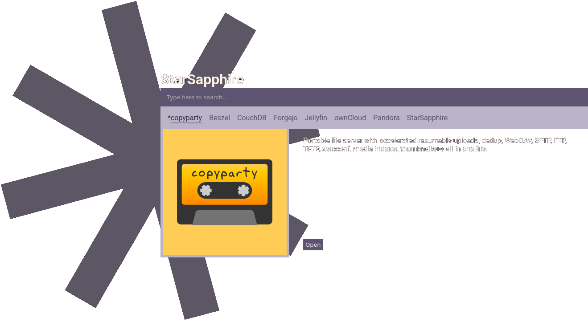

# StarSapphire
StarSapphire is a simple, yet possibly perfect, landing page for your home server. It acts like a search engine for all the services you have available.

It is made entirely in browser JS, meaning that all you need is a web server.



## Features
- Search
- Favorite service on right click
- Launchs the service on enter

## Configuration
Place your services inside `services.json`, make sure the client can fetch this from your web server (it probably can out of the box):

```json
{
    "name": "CouchDB",
    "description": "Apache CouchDB is an open-source document-oriented NoSQL database, implemented in Erlang. CouchDB uses multiple formats and protocols to store, transfer, and process its data. It uses JSON to store data, JavaScript as its query language using MapReduce, and HTTP for an API.Beszel is a lightweight server monitoring platform that includes Docker statistics, historical data, and alert functions. It has a friendly web interface, simple configuration, and is ready to use out of the box. It supports automatic backup, multi-user, OAuth authentication, and API access.",
    "logo": "must-be-in-logos-folder.png",
    "link": "http://yoururl.org/",
    "background": "#c5c5c5",
    "color": "black",
    "padding": "2em"
}
```